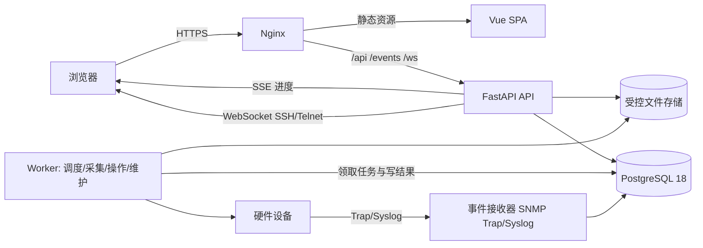

# Warden 0.1.0 系统架构

状态：`APPROVED_BASELINE`

## 1. 架构目标

架构必须同时满足：

- 私有网络内独立运行；
- 统一呈现多厂商设备，同时保留真实能力差异；
- 长时间采集和危险操作不阻塞 Web API；
- 操作任务和审计在进程/主机重启后仍可解释；
- 单机易部署、数据卷边界明确，不引入未经现场负载证明必要的中间件或集群复杂度；
- 从需求编号到适配器、API、页面和测试全链路可追踪。

## 2. 技术选型

版本以开始实现时锁文件中的精确版本为准；下表的主版本是设计契约，不允许无 ADR 跨主版本升级。

| 层 | 选型 | 基线 | 用途与理由 |
| --- | --- | --- | --- |
| Web | Vue、TypeScript、Vite | Vue 3.5、TypeScript 7、Vite 8 | 交互密集的设备详情与表格；官方推荐 Vue + TypeScript + Vite |
| 前端状态/路由 | Pinia、Vue Router | Pinia 4、Router 5 | 认证态、筛选态和路由权限 |
| UI/图表 | Element Plus、ECharts | Element Plus 2、ECharts 6 | 管理界面组件和监控趋势图 |
| 前端测试 | Vitest、Playwright | Vitest 4、Playwright 当前稳定版 | 单元/组件和端到端测试 |
| API | Python、FastAPI、Pydantic | Python 3.13、FastAPI 0.141、Pydantic 2 | 类型化 API、OpenAPI、WebSocket/SSE，设备协议生态成熟 |
| 数据访问 | SQLAlchemy、Alembic、psycopg | SQLAlchemy 2、Alembic 1、psycopg 3 | 事务、迁移和 PostgreSQL 访问 |
| 后台执行 | PostgreSQL 持久化任务 + Python Worker | PostgreSQL 18、应用 Worker | 任务记录即执行授权，使用行锁、租约和独立并发池，不维护第二套消息状态 |
| 数据库 | PostgreSQL | 18（当前小版本） | 权威状态、事务、JSONB、分区指标表和全文检索 |
| 入口 | Nginx | 当前稳定版 | TLS、静态文件、API/SSE/WebSocket 反向代理 |
| 部署 | Docker Compose | Compose v2 | 单机私有部署、进程隔离和可重复升级 |

选择依据：

- Vue 官方为新项目推荐 Vite 和 TypeScript：<https://vuejs.org/guide/typescript/overview>；
- Vite 8 支持现代浏览器并要求 Node 20.19+/22.12+，构建环境固定 Node 24 LTS：<https://vite.dev/guide/>；
- FastAPI 官方部署模型覆盖 HTTPS、进程重启、启动和容器化：<https://fastapi.tiangolo.com/deployment/concepts/>；
- PostgreSQL 18 官方支持至 2030，部署始终跟随 18 的最新小版本：<https://www.postgresql.org/support/versioning/>。

## 3. 运行组件



### 3.1 `web`

Nginx 提供同源入口：

- `/`：Vue 构建产物；
- `/api/v1/`：FastAPI；
- `/api/v1/events/stream`：SSE；
- `/api/v1/terminal/`：WebSocket；
- 不直接暴露 PostgreSQL、文件目录或 Worker。

### 3.2 `api`

负责认证授权、设备配置、查询、操作预览、任务创建、文件授权下载和 OpenAPI。普通 HTTP handler 不直接执行可能超过 2 秒的设备交互；浏览器 SSH/Telnet 是明确例外，由隔离的异步 WebSocket 会话处理并受并发/时限约束，不占用普通请求 Worker。

### 3.3 `worker`

一个后台服务运行四个彼此限流的循环/并发池：

- 调度循环只把到期采集计划写成 `scheduled` 的 `collection_run`；advisory lock 防止重复调度；
- 采集池使用 `FOR UPDATE SKIP LOCKED` 领取读取任务，执行可达性、健康、指标、组件和事件采集；读取失败按退避策略重试；
- 操作池只领取 `contracts/operations.json` 中 `channel=task` 的人工任务，按 profile 互斥范围执行 preflight、dispatch fence、调用和验证；
- 维护循环执行指标聚合、保留清理、文件引用检查和过期租约恢复。

采集池与操作池使用独立并发上限，长时间固件/诊断任务不能占满采集槽位。所有领取、租约、进度和结果先写 PostgreSQL；`channel=launch` 由 API/终端会话层处理。

### 3.4 `event-ingest`

接收 SNMP Trap 和 Syslog，转换为统一设备事件。容器内使用非特权端口，宿主机将 UDP 162/514 映射到容器端口；未配置接收时，适配器仍通过轮询获取事件。

### 3.5 PostgreSQL

保存唯一权威状态：用户、会话、设备、能力、当前组件、指标、事件、告警、采集任务、操作任务、短期 UI 事件、文件元数据和审计。Worker 直接从数据库领取任务；所有有副作用的业务事务在 PostgreSQL 中提交后才向用户报告已接受。

### 3.6 受控文件存储

0.1.0 使用宿主机持久化卷，不引入 MinIO。文件按内容散列组织，数据库保存元数据；用户访问经过授权 API。需要设备主动拉取的 Redfish 固件/虚拟介质使用绑定设备 IP、文件、用途和时限的专用票据端点。配置备份和支持包由应用层加密，固件/ISO 至少校验 SHA-256 和访问权限。

## 4. 代码架构

采用单仓库、模块化单体，不拆微服务代码仓库：

```text
warden/
├─ frontend/
│  ├─ src/api/              # OpenAPI 生成类型与调用封装
│  ├─ src/components/       # 通用展示组件
│  ├─ src/features/         # devices/alerts/operations/files/audit/users/system
│  ├─ src/router/
│  ├─ src/stores/
│  └─ tests/
├─ backend/
│  ├─ app/api/              # HTTP/SSE/WebSocket 适配层
│  ├─ app/application/      # 用例、权限、任务编排
│  ├─ app/domain/           # 设备能力、状态机、错误模型
│  ├─ app/adapters/         # Redfish/DSM/Huawei 设备适配
│  ├─ app/infrastructure/   # DB、文件、加密、协议客户端
│  ├─ app/workers/          # 采集、操作、调度、事件接收
│  ├─ migrations/
│  └─ tests/
├─ deployment/
│  ├─ compose/
│  ├─ nginx/
│  └─ scripts/
├─ docs/
└─ tests/hardware-certification/
```

依赖方向固定为：`api/adapters/infrastructure -> application -> domain`。`domain` 不导入 FastAPI、SQLAlchemy 或厂商 SDK。

## 5. 关键数据流

### 5.1 周期采集

1. 调度循环锁定到期设备并在 PostgreSQL 生成 `collection_run`；
2. 采集池按行锁和租约领取后，根据 `adapter_key` 加载适配器；
3. 适配器读取统一 `ObservationBatch`；
4. 在一个数据库事务中更新组件当前态、写入指标/事件、记录逐项错误，并按认证健康规则更新设备可达性与健康；没有异常不得被当作健康证据；
5. 当前问题汇总器只按 `alert-rules.json` 的设备当前状态/告警、离线和过期规则打开或恢复记录；设备事件只写历史；
6. 更新下次采集时间，并在同一事务写轻量 `ui_events`。

单个指标失败不丢弃整批成功数据；每个观测值带质量状态和错误来源。

### 5.2 人工操作

1. API 按 `contracts/operations.json` 和持久化 `DeviceSnapshot` 校验权限、支持状态、当前可用性和参数，纯函数生成操作预览，不连接设备；
2. 用户确认后，API 在同一事务中创建 `operation_task` 和审计记录；
3. Worker 以 PostgreSQL 条件更新领取租约并获取设备互斥；任务行本身是唯一执行授权；
4. Worker 重新检查设备、权限和能力，执行实时只读 `preflight_operation`；前置状态漂移则 fence 前安全失败；
5. preflight 通过后提交 `dispatch_started_at`、参数/计划散列和适配器版本，再调用适配器执行；有厂商 job ID 时先持久化再轮询；
6. 按动作 profile 回读验证；
7. 写入最终状态、产物文件和审计结果；
8. 失败或超时按错误分类处理；有副作用 profile 在 dispatch fence 后崩溃或结果不明只核验并进入 `verification_required`，不自动重放；纯读取 profile 可按新 attempt 重试。

### 5.3 实时更新

SSE 只从 PostgreSQL 的短期 `ui_events` 读取实体类型、实体 ID、版本号和事件类型，不推送大块指标数据。前端收到后重新读取对应 REST 资源。断线后使用 `Last-Event-ID` 恢复；超过 10 分钟保留窗口则全量刷新。允许使用 PostgreSQL `LISTEN/NOTIFY` 降低轮询延迟，但正确性不能依赖通知送达。

### 5.4 浏览器终端

API 签发一次性、60 秒有效终端票据；WebSocket 建立后由 API 进程连接目标 SSH/Telnet。会话最长 2 小时，空闲 15 分钟断开；Telnet 默认关闭。终端流不进入普通日志。

## 6. 并发与一致性

- 设备配置使用 `version` 乐观锁，API 更新要求 `If-Match`；
- 同一设备最多一个变更操作运行；只读采集在变更操作期间按动作声明暂停或降频；
- 操作提交使用 `Idempotency-Key`，同一用户/设备/动作/参数在 24 小时内重复键返回原任务；
- 指标允许至少一次写入，唯一键去重；操作不允许至少一次执行语义；
- 任务状态和审计在同一事务中推进，通知在事务提交后发送；
- 任务领取、设备互斥和 dispatch 状态只以 PostgreSQL 条件更新、唯一约束和行锁为准；不得在内存或其他中间件维护第二套执行授权。

## 7. 失败与恢复

| 故障 | 处理 |
| --- | --- |
| 设备超时 | 读取任务退避重试；变更任务不自动重放，必要时进入待核验 |
| 凭据错误 | 标记 `authentication_failed`，停止高频重试；设备页显示明确错误，相关数据按时间进入过期状态 |
| Worker 崩溃 | fence 前可重新领取；有副作用 profile 在 fence 后只查 job/回读，禁止重复调用；纯读取可新 attempt 重试 |
| API 重启 | 浏览器重连 SSE/WS；持久化任务不受影响 |
| PostgreSQL 不可用 | 禁止接受新操作；采集任务失败且不使用内存结果冒充持久化成功 |
| 文件卷不可用 | 禁止上传/升级/日志采集；监控读取仍可继续 |
| 进程重复启动 | 调度 advisory lock、任务唯一键和设备操作锁防止重复执行 |

## 8. 指标采集与容量

默认周期：

- 基础可达性和综合健康：30 秒；
- 设备指标、端口、磁盘、电源、风扇：60 秒；
- SEL/DSM 日志/交换机关键日志：120 秒；
- 资产、FRU、固件和完整能力发现：6 小时；
- 人工操作结束后立即触发相关能力回读。

指标只在设备支持时采集。交换机流量按 60 秒计算速率，计数器只作派生输入/变化检查点，查询使用规范速率。当前值独立 upsert；状态历史只在变化和 6 小时检查点写入。默认原始点保留 7 天、5 分钟数值聚合 30 天、1 小时数值聚合 180 天；详细策略见 `DATA_MODEL.md`。

0.1.0 不把未确认的设备数量写成产品上限。正式部署前从现场设备、端口/组件、实际发现的活跃序列、采集周期和保留周期生成验收负载；使用真实 schema 测量单点、索引、聚合、清理和临时空间后给出该部署的 CPU/RAM/磁盘建议。当前值、状态变化写和分层保留是固定的数据控制手段，容量数字是现场产物而不是全局设计常量。

## 9. 可观测性

- 所有进程输出结构化 JSON 日志，包含 `request_id`、`task_id`、`device_id`，禁止记录凭据；
- `/health/live` 只检查进程，`/health/ready` 检查必要依赖；
- `/system/status` 直接汇总 API/Worker/数据库/文件卷/接收器状态、采集失败和待核验任务；0.1.0 不提供 Prometheus 指标端点或通用运维监控平台。

## 10. 架构验收

- 重启 Worker、API 或主机后，任务与审计仍可解释；
- 同一危险操作重复提交不会执行两次；
- 任何厂商协议引用只出现在 `app/adapters` 或 `app/infrastructure/protocols`；
- PostgreSQL 故障时系统拒绝新硬件操作；
- 现场声明的验收负载下 API P95、采集延迟和任务领取延迟满足 `PROJECT_SPEC.md`；
- 所有容器可由 Compose 在无公网环境使用预加载镜像启动。
