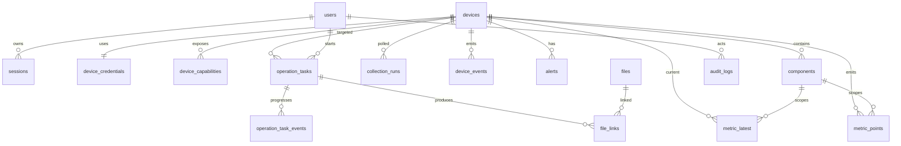
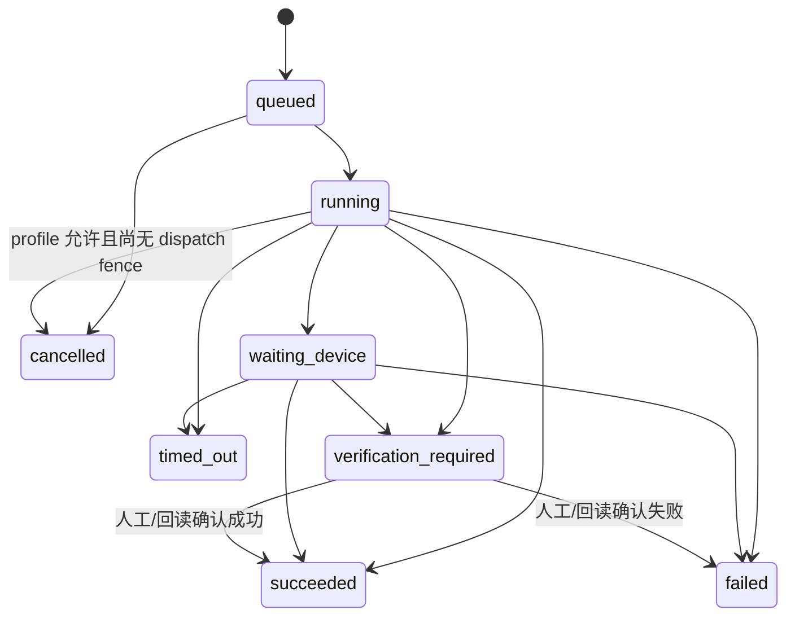

# Warden 0.1.0 数据模型

状态：`APPROVED_BASELINE`

## 1. 通用约定

- 主键使用 UUIDv7；
- 数据库存储 UTC `timestamptz`；
- 枚举在应用层和数据库 `CHECK` 约束中同时验证；
- 表名、字段名、能力键和 API 枚举使用英文 snake_case；界面显示中文；
- 厂商扩展放在受版本控制的 JSONB 字段中，核心查询字段不得只存在于 JSONB；
- 所有可编辑实体包含 `created_at`、`updated_at` 和整数 `version`；
- 凭据密文和受控文件内容不得出现在审计详情、错误详情或普通 API 响应中。

## 2. 关系概览

## 3. 身份与授权

### 3.1 `users`

关键字段：`username`（大小写不敏感唯一）、`display_name`、`password_hash`、`role`、`status`、`failed_login_count`、`locked_until`、`last_login_at`。

状态：`active`、`disabled`、`locked`。删除用户使用禁用，不做硬删除。

### 3.2 `role`

每个用户恰有一个角色枚举：`admin`、`operator`、`viewer`。权限矩阵是 `SECURITY.md` 的代码常量，`GET /roles` 只读返回该矩阵；不建立 `roles`、`permissions`、`user_roles` 或 `role_permissions` 表，也不提供自定义角色。

### 3.3 `sessions`

保存 opaque session ID 的哈希、用户、创建/最后活动/绝对过期时间、`reauthenticated_at`、CSRF secret 哈希、客户端摘要和撤销时间。原始会话令牌只存在于 Secure HttpOnly Cookie；密码/角色变化、会话撤销或超过 5 分钟会使高风险复验失效。

## 4. 设备与凭据

### 4.1 `devices`

| 字段 | 说明 |
| --- | --- |
| `name` | 用户定义、全局唯一的设备名称 |
| `device_type` | `server`、`synology_nas`、`core_switch`、`access_switch` |
| `vendor`、`model` | 发现后的规范值 |
| `management_endpoint` | HTTPS 主机/IP 或交换机管理 IP；不含凭据 |
| `adapter_key` | 适配器注册键 |
| `connection_config` | 非敏感协议配置 JSONB，如端口、TLS 校验、SNMP 版本 |
| `enabled` | 是否允许采集和操作 |
| `readiness` | `not_ready`、`ready`、`misconfigured` |
| `reachability` | `unknown`、`online`、`offline` |
| `health` | `unknown`、`healthy`、`warning`、`critical` |
| `last_known_health` | 离线时保留最后已知健康 |
| `serial_number`、`firmware_version` | 设备发现值 |
| `last_seen_at` | 最近成功基础连接 |
| `last_collected_at` | 最近完整采集 |
| `next_poll_at` | 下一次采集调度时间 |
| `consecutive_failures/successes` | 可达性滞回计算 |

同一管理地址允许不同协议端口，但 `(device_type, management_endpoint, adapter_key)` 唯一，防止重复接入。

### 4.2 `device_credentials`

与设备一对一，包含 `ciphertext`、`nonce`、`key_version`、`secret_schema_version` 和轮换时间。明文结构由适配器声明，例如 Redfish 用户名/密码、DSM 账号、SNMPv3 参数、SSH 账号。API 从不返回密文或“可逆掩码”。

### 4.3 `device_capabilities`

联合唯一键 `(device_id, capability_key)`。字段包括 `support_state`（`supported`、`unsupported`、`not_configured`）、来源需求编号、发现方法、原因代码、详情、最后检查时间和适配器版本。

`runtime_availability` 不落在本表，由 API 根据设备启用/就绪/可达性、系统维护模式、凭据状态和互斥任务动态计算为 `available` 或 `temporarily_unavailable`。能力支持状态变化写采集/系统事件；只有人工修改设备配置才写用户审计。能力 `unsupported` 不等于实现完成，正式支持状态由认证矩阵决定。

### 4.4 `components`

统一组件当前态：`kind`（processor、memory、drive、raid、psu、fan、sensor、interface、transceiver、poe_port、storage_pool、volume、ups 等）、`native_id`、`name`、`status`、`properties`、`first_seen_at`、`last_seen_at`、`retired_at`。

联合唯一键 `(device_id, kind, native_id)`。组件从设备消失时软标记 retired，不删除历史。

## 5. 采集、指标与事件

### 5.1 `collection_runs`

字段：设备、采集类型、计划/开始/结束时间、状态、尝试次数、成功/失败指标数、错误代码和摘要。

状态：`scheduled`、`running`、`succeeded`、`partial`、`failed`、`cancelled`。同一设备同一采集类型最多一个 `running`。

### 5.2 `metric_points`

字段：`observed_at`、设备、可选组件、`metric_key`、`value_double`、`value_text`、`unit`、`quality`、`source`、`collection_run_id`。键、类型、规范单位、范围和聚合语义必须来自 `contracts/metrics.json`。

约束：数值和文本恰有一个非空；唯一键 `(device_id, component_id, metric_key, observed_at, source)`。按 `observed_at` 日分区，预创建未来 14 天。

高频计数器保存设备原始累计值，派生速率使用独立 metric key，重启/计数器回绕时质量标记 `partial`，不生成负速率。

指标不支持或本次读取失败时不插入伪值；失败明细写入 `collection_observation_errors`（采集批次、指标/事件键、可选组件、稳定错误码、阶段和脱敏详情）。事件键只写 `device_events`，不得写入 `metric_points`。

### 5.3 `metric_latest`

每个 `(device_id, component_id, metric_key)` 一行当前可信值，成功观测时 upsert 值、单位、质量、来源和 `observed_at`。新鲜度从本表观测时间和该指标所属采集周期计算，不能用历史点是否存在推断。

数值 gauge/派生速率按采集周期写 `metric_points`；枚举/布尔状态仅在值或质量变化时写历史点，并每 6 小时写一个检查点。累计计数器用于派生后，只在变化或每 6 小时检查点写历史，避免每分钟重复相同错误计数。

### 5.4 `metric_rollups_5m`、`metric_rollups_1h`

只对数值 gauge/速率保存窗口 min/max/avg/last/count/quality；状态不做数值聚合。联合唯一键为设备、组件、指标和窗口开始。5 分钟聚合从原始点生成，1 小时聚合从已封闭 5 分钟窗口生成，均可幂等重算。

### 5.5 `device_events`

字段：设备、可选组件、事件类型、严重级别、消息、发生/接收时间、来源（redfish_sel、dsm_log、snmp_trap、syslog、poll）、厂商原始 ID、去重散列和脱敏详情。

联合唯一键优先使用 `(device_id, source, native_event_id)`；无原始 ID 时使用稳定内容散列和时间窗口去重。

## 6. 告警

### 6.1 `alerts`

字段：设备、可选组件、规则键、严重级别、状态、标题、证据、首次/最近发生/恢复时间和稳定 `dedupe_key`。

状态仅 `active`、`resolved`。唯一的活动告警约束：同一 `dedupe_key` 最多一条 `active`。

规则只从 `contracts/alert-rules.json` 加载，不建立可编辑 `alert_rules` 表。连接离线按连续成功恢复，设备状态按后续可信正常观测恢复。设备事件只保留在事件历史，不生成当前问题；数值指标无来源告警语义时也不参与判断。0.1.0 不含人工确认状态。

## 7. 操作任务

### 7.1 `operation_tasks`

| 字段 | 说明 |
| --- | --- |
| `requirement_id` | 原始需求编号，如 `SRV-ACT-02` |
| `capability_key` | 统一能力键 |
| `device_id` | 唯一目标设备；0.1.0 不支持批量目标 |
| `requested_by` | 发起用户 |
| `risk_level` | `low`、`medium`、`high` |
| `parameters` | 已验证且已脱敏的 JSONB 参数 |
| `idempotency_key` | 客户端幂等键 |
| `state` | 任务状态 |
| `progress_percent`、`current_step` | 用户可见进度 |
| `lease_owner/lease_expires_at` | Worker 租约 |
| `dispatch_started_at` | 首次准备调用设备前提交的不可逆 dispatch fence |
| `plan_hash/parameter_hash/adapter_version` | 防止恢复时计划漂移的固定执行证据 |
| `device_job_id` | 厂商异步作业 ID；存在时只查询，不重复创建 |
| `timeout_at` | 总超时 |
| `result_summary` | 脱敏结果 |
| `error_code/error_detail` | 稳定错误和安全详情 |
| `verification_state/evidence` | 回读验证结果和证据摘要 |
| `started_at/finished_at` | 生命周期时间 |

唯一约束 `(requested_by, idempotency_key)`。同一设备存在 running/waiting_device 变更任务时，数据库约束阻止第二个冲突任务进入运行。

API 在同一 PostgreSQL 事务中创建 `queued` 任务和审计。Worker 使用 `FOR UPDATE SKIP LOCKED` 条件领取并写入租约；任务行本身就是唯一执行授权，不维护消息 outbox 或第二套队列状态。Worker/主机重启后由租约恢复器处理过期任务。

### 7.2 状态机

- `cancelled` 只允许 queued，或 running 但尚无 `dispatch_started_at` 且 profile 声明可取消；任何 fence 后取消请求都返回冲突；
- `timed_out` 代表明确超时且确认没有继续执行的证据；
- 设备可能已经接受命令但连接中断时必须使用 `verification_required`，不得使用 `failed` 并自动重试；
- 终态不可原地重跑，新执行创建新任务。
- 已有 `dispatch_started_at` 且 profile `side_effect=true` 的恢复任务禁止再次进入 `execute_operation`；只能查询设备作业或执行回读核验。`side_effect=false` 可增加 attempt 后重试只读调用，但已有 `device_job_id` 时只能查询原作业。

### 7.3 `operation_task_events`

追加式事件流：状态、步骤、进度、设备作业 ID、脱敏消息和时间。禁止更新/删除历史事件。

## 8. 文件

### 8.1 `files`

字段：类型、原始文件名、安全存储名、大小、MIME、SHA-256、存储后端、加密标志、密钥版本、上传者、创建时间、状态和元数据。

状态：`uploading`、`ready`、`quarantined`、`deleted`。上传完成前不可被任务使用。

### 8.2 `file_links`

将文件与设备、任务和用途关联，避免在任务 JSON 中存路径。用途：`input_firmware`、`input_virtual_media`、`output_support_bundle`、`output_config_backup`、`output_operation_log`。

配置备份和支持包默认应用层加密。删除文件只允许管理员，采用逻辑删除 + 延迟物理清理并写审计；仍被未完成任务引用的文件不可删除。

## 9. 审计

### 9.1 `audit_logs`

只追加，不允许业务 API 修改或删除。字段：时间、用户/会话、动作、资源类型/ID、设备 ID、需求编号、请求 ID、任务 ID、结果、来源 IP、User-Agent 摘要和变更前后差异的脱敏版本。0.1.0 的审计目标是操作追踪，不建设散列链、独立链头、签名或外部见证。

## 10. 保留与清理

默认分层保留用于限制单机数据持续增长；部署可降低保留期，不能在未测容量时提高。正式安装必须根据实际设备、端口/组件数量、发现后的活跃序列和保留周期生成验收负载，并用真实 schema 测得表、索引、聚合、清理和临时空间成本；设计阶段不承诺固定设备数或磁盘容量。

| 数据 | 默认保留 |
| --- | --- |
| 原始数值指标/状态变化点 | 7 天 |
| 5 分钟数值聚合 | 30 天 |
| 1 小时数值聚合 | 180 天 |
| 设备事件 | 180 天 |
| 已恢复告警 | 180 天 |
| 操作任务与任务事件 | 365 天 |
| 审计日志 | 365 天，且不得早于关联任务 |
| 登录会话 | 过期后 30 天清理 |
| 支持包/操作日志 | 30 天，可由管理员延长 |
| 固件/ISO | 由管理员显式删除 |
| 配置备份 | 默认保留最近 10 份/设备，至少 90 天 |

清理任务先记录清理批次和数量，再分批删除；不得级联删除任务、审计或设备历史。

## 11. 事务边界

- 添加/更新设备与凭据在同一事务提交；
- 采集批次内组件当前态、指标、事件、告警和设备状态在一个事务提交；
- 操作任务创建与“已接受操作”审计在同一事务提交；
- 任务终态、验证结果、产物关联和结束审计在同一事务提交；
- 文件元数据 `ready` 只在内容落盘、哈希和权限设置成功后提交；
- 供 SSE 使用的轻量 `ui_events` 与实体变更在同一事务写入，默认保留 10 分钟；SSE 断线后按事件 ID 读取，窗口外要求客户端全量刷新。

## 12. 迁移规则

- Alembic 迁移只前进，不在生产自动 downgrade；
- 破坏性列变更采用 expand/migrate/contract，至少跨一个发布完成；
- 每个迁移包含升级前空间估算、回滚方案和数据校验 SQL；
- Compose 启动时由独立一次性 `migrate` 容器执行迁移，API 不自行抢跑迁移。
